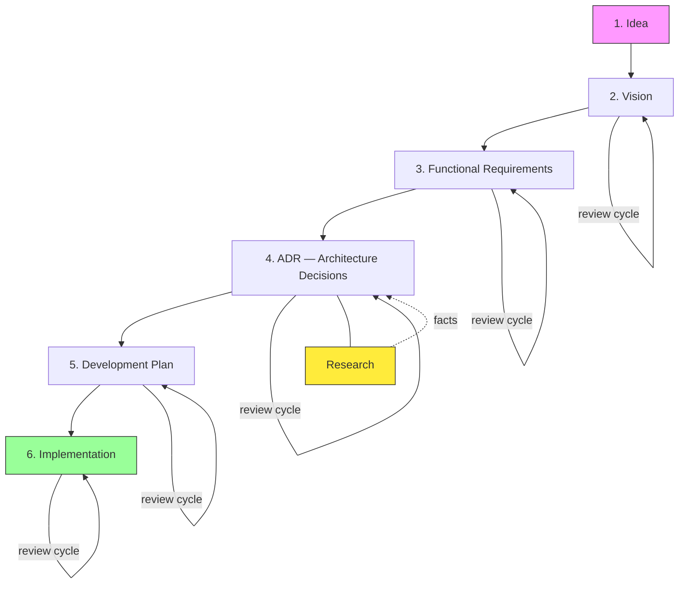
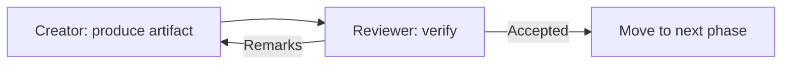
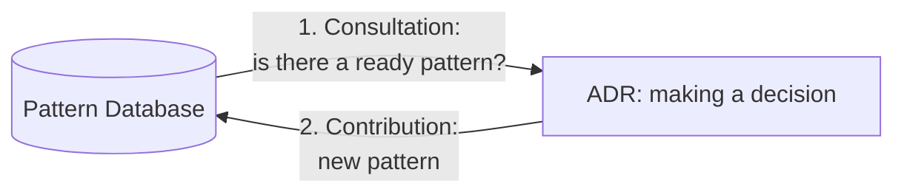
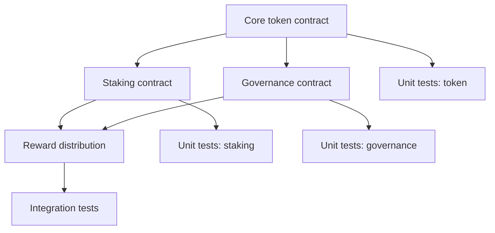
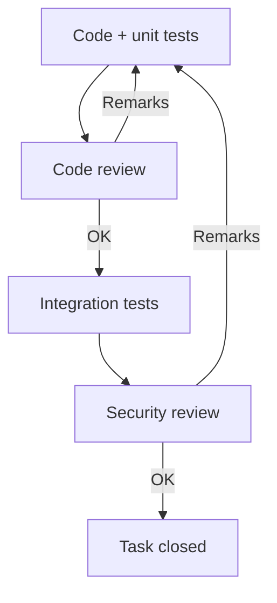

# Smart Contract Development Process

A formalized process for developing smart contracts using LLM agents.

## Why

LLMs are good at generating code but struggle to maintain consistency across project parts. This process solves the problem through:
- Splitting work into phases with explicit artifacts
- Separation of roles: creator != reviewer (different agents, different prompts)
- "Trust only artifacts" principle -- the reviewer checks files, never trusts claims

## Phases

```
Idea -> Vision -> Requirements -> ADR (+ Research as needed) -> Plan -> Implementation
```

Each phase follows a cycle: **creator -> reviewer -> (remarks -> creator)\* -> accepted -> next phase**.

## Prompts

Ready-made prompts for each role at each phase. Each file is self-contained and can be copied for use in any LLM.

| Phase | Creator | Reviewer |
|-------|---------|----------|
| Vision | [01-vision-creator](../skills/run-phase/references/01-vision-creator.md) | [01-vision-reviewer](../skills/run-phase/references/01-vision-reviewer.md) |
| Requirements | [02-requirements-creator](../skills/run-phase/references/02-requirements-creator.md) | [02-requirements-reviewer](../skills/run-phase/references/02-requirements-reviewer.md) |
| ADR (scoper) | [04-adr-scoper](../skills/run-phase/references/04-adr-scoper.md) | -- (user edits the list) |
| ADR (research) | [03-research-creator](../skills/run-phase/references/03-research-creator.md) | [03-research-reviewer](../skills/run-phase/references/03-research-reviewer.md) |
| ADR (decisions) | [04-adr-creator](../skills/run-phase/references/04-adr-creator.md) | [04-adr-reviewer](../skills/run-phase/references/04-adr-reviewer.md) |
| Plan | [05-plan-creator](../skills/run-phase/references/05-plan-creator.md) | [05-plan-reviewer](../skills/run-phase/references/05-plan-reviewer.md) |
| Implementation | [06-implementation-creator](../skills/run-phase/references/06-implementation-creator.md) | [06-implementation-reviewer](../skills/run-phase/references/06-implementation-reviewer.md) |

## How to Use

### Manually (any LLM)

1. Read this document -- understand the phases and principles
2. For each phase -- take the creator prompt, fill in project data, run it
3. Pass the result to the reviewer prompt
4. Repeat the cycle until the reviewer writes "ACCEPTED"
5. For ADR: scoper first -> review the list -> for each DT: research (if needed) -> ADR cycle
6. Move to the next phase

### Automatically (Claude Code)

```
/run-phase vision          # Vision: creator -> reviewer cycle
/run-phase requirements    # Requirements: creator -> reviewer cycle
/run-phase adr             # ADR: scoper -> pause -> [research] -> ADR cycle
/run-phase research        # Research: standalone cycle for one question
/run-phase plan            # Plan: creator -> reviewer cycle
/run-phase implementation  # Implementation: creator -> reviewer cycle
```

Modes:
- **From scratch** -- create artifact + review
- **Resume** -- review an existing artifact, then continue the cycle as usual

## Key Principles

- **Reviewer trusts only artifacts** -- does not trust the creator's claims, verifies each item personally
- **Forced disagreement** -- the reviewer must find at least 3 issues
- **Research before decisions** -- understand first, decide later (ADR)
- **Pattern database** -- ADR consults existing [patterns](../patterns/) and contributes new ones back

---

## Idea

Formalize the smart contract development process using LLM agents. The goal is to produce a reproducible pipeline where each phase has a clear artifact, readiness criteria, and a review cycle.

## Context

LLMs are good at generating code but struggle to maintain consistency across project parts. Key problems:
- They jump ahead (implementation details during the requirements phase)
- Architecture-level hallucinations (non-existent APIs, impossible patterns)
- They are lenient toward their own code during self-review

The solution is to split the process into phases with different agents (creator != reviewer) and explicit checklists.

## Overall Process Diagram



## Review Cycle (applied at every phase)



Key point: **the creator and reviewer are different agents with different prompts**.
- The creator optimizes for "make it complete and correct"
- The reviewer optimizes for "find problems, contradictions, and gaps"

---

## Phase Details

### Phase 1: Idea

**Input:** a thought, a problem, an observation

**Output:** 2-3 sentences describing what we want to build and why

**Transition criterion:** it is clear what the project is about (can be explained in 30 seconds)

---

### Phase 2: Vision

**Goal:** capture the "why" and "for whom" without sliding into "how"

**Artifact -- Vision document:**
- **Problem** -- what pain point or challenge we are solving
- **Project goal** -- what we want to achieve as a result
- **Users** -- who will use it (types, roles)
- **Key metrics** -- how we will measure success (TVL, volume, retention...)
- **Non-goals** -- what is explicitly OUT of scope (important for constraining LLMs)

**Review checklist:**
- [ ] The problem is specific (not "improve DeFi" but "reduce slippage for swaps > $100k")
- [ ] Users are described with context (not "traders" but "traders who...")
- [ ] Metrics are measurable
- [ ] No implementation details (languages, frameworks, specific protocols)
- [ ] Non-goals define clear boundaries

---

### Phase 3: Functional Requirements

**Goal:** describe WHAT the system does, without HOW

**Artifact -- Requirements document (ONLY 3 sections):**
- **Functional requirements** (FR-XXX) -- what the system must be able to do (grouped by feature/module)
- **Constraints** (C-XXX) -- what the system must work with (networks, protocols, limits)
- **Security requirements** (SR-XXX) -- smart contract specifics (access control, upgrade, pause)

No additional sections (Design Principles, Scenarios, Architecture, etc.). Scenarios belong in the development plan (phase 5).

**Review checklist:**
- [ ] Only 3 allowed sections (FR, Constraints, Security Requirements)
- [ ] Each requirement is a "what", not a "how" (no mention of Solidity, specific data structures)
- [ ] Does not contradict Vision (metrics, users, non-goals)
- [ ] Security requirements account for blockchain specifics (immutability, front-running, reentrancy)
- [ ] Each requirement is testable (has a clear pass/fail condition)
- [ ] No use cases / scenarios (those belong in the plan)

---

### Phase 4: ADR (Architecture Decision Records)

**Goal:** record key technical decisions with rationale

This is a **cross-cutting process** -- ADRs can appear at any stage, but the main batch is created here.

#### Step 1: Scoping

The **scoper** analyzes Requirements and determines:
- Which architectural decisions need to be made (DT-001, DT-002, ...)
- Which decisions require preliminary research (facts about external systems)
- Dependencies between decisions

**After scoping -- pause.** The user reviews the list, edits it, approves. The user can mark some decisions as "already decided" (these skip the ADR cycle).

#### Step 2: Research (sub-step, as needed)

If a decision requires facts about external systems, a research cycle (creator -> reviewer) runs before the ADR. Research answers the question "how does X work?", not "what should we choose?".

**Artifact -- Research Document:** question, sources, findings with proofs, conclusions for the project.

#### Step 3: Making Decisions

For each approved DT (in dependency order) -- a creator -> reviewer cycle with research findings as input.

**Artifact -- a set of ADRs, each containing:**
- **Context** -- what problem we are solving
- **Options** -- what solutions were considered (at least 2)
- **Existing patterns** -- what already exists in the [pattern database](../patterns/)
- **Decision** -- what was chosen and why
- **Consequences** -- what this means for the project (trade-offs)

**Typical ADRs for smart contracts:**
- Upgradeability (proxy vs immutable)
- Network / L2
- Data storage pattern
- Oracle selection
- Algorithms (calculation formulas, bonding curves...)
- Access control model

#### Pattern Database

The team maintains a repository of proven [smart contract patterns](../patterns/). It participates in the process at two points:



**1. Consultation (ADR input):**
Before making a decision -- check the [pattern database](../patterns/):
- Is there a pattern that solves this problem?
- If yes -- use it as one of the options in the ADR (with rationale on whether it fits)
- If a pattern exists but does not fit -- record why (this is valuable information for the database)

**2. Contribution (ADR output):**
After making a decision -- check whether the database needs updating:
- The decision uses a new pattern not in the database -> add it
- The decision modifies an existing pattern -> add a variation or update
- The decision rejects an existing pattern -> add a "when NOT to use" section to the pattern

**Review checklist:**
- [ ] The [pattern database](../patterns/) was checked for relevant solutions
- [ ] If a pattern was found -- the choice is justified (use / do not use)
- [ ] At least 2 options considered for each ADR
- [ ] Trade-offs are explicitly described (not "best option" but "best for our case because...")
- [ ] Decisions do not contradict each other
- [ ] Decisions do not contradict Requirements and Vision
- [ ] For algorithms -- formulas or pseudocode are present
- [ ] If a new pattern was adopted -- a task to add it to the database is created

---

### Phase 5: Development Plan

**Goal:** break the project into tasks with a dependency tree

**Artifact -- task list:**
- Each task is atomic (one contract, one module, one test)
- Dependency tree: what must be done first
- Contract deployment order
- For each task: which tests are needed

**Estimates and timelines do not matter.** What matters is correct decomposition and ordering.



**Review checklist:**
- [ ] Each task is atomic (can be done and verified in isolation)
- [ ] Dependencies are correct (no cycles, nothing missing)
- [ ] Deployment order is accounted for (which contract deploys first)
- [ ] Every contract has a test task
- [ ] Covers all Requirements (no requirement is lost)
- [ ] Does not contradict ADR (uses the chosen solutions)

---

### Phase 6: Implementation

**Goal:** write code, tests, deploy

Each task from the plan goes through its own review cycle:



**Sub-phases:**

**6a. Code + Unit Tests**
- One contract/module at a time
- Tests are written alongside the code (not after)
- Coverage: happy path + edge cases + revert cases

**6b. Integration Tests**
- Interaction between contracts
- Scenarios from Requirements (phase 3)
- Fork tests for interaction with external protocols

**6c. Security Review**
- Security checklist (reentrancy, access control, overflow, front-running...)
- Verification of ADR compliance
- Attack vector analysis

**Review checklist (for each task):**
- [ ] Code conforms to ADR (uses the chosen solutions)
- [ ] Unit tests cover happy path, edge cases, revert cases
- [ ] No hardcoded values (magic numbers)
- [ ] Events are emitted for all state changes
- [ ] Access control on all external functions
- [ ] No reentrancy vulnerabilities
- [ ] Checks for zero addresses and empty values
- [ ] Gas optimization does not sacrifice readability

---

## Cross-Phase Validation

At every transition the reviewer additionally checks **consistency with previous phases**:

| Transition | What to verify |
|------------|----------------|
| Vision -> Requirements | Are all users from Vision covered by scenarios? Can metrics be measured through Requirements? |
| Requirements -> ADR | Did the scoper find all decisions? For each DT with research -- were findings obtained? No unexplored "black boxes"? |
| ADR -> Plan | Does the plan use decisions from ADR? No tasks contradicting ADR? |
| Plan -> Implementation | Is every task from the plan implemented? No requirement lost? |

---

## Agent Roles

### Principle: Trust Only Artifacts

> **The reviewer trusts only artifacts (code, documents, tests) -- never the creator's claims.**

If the creator says "all requirements are covered", the reviewer reads the code and checks every FR-XXX personally. This is the key difference from a formal review where the checker takes the author at their word.

Mechanisms to guard against "trust by word":
- **The reviewer works only with files.** The artifact on disk is the single source of truth. Creator messages are ignored.
- **Forced disagreement.** Every reviewer must find at least 3 issues. If they cannot, they must justify why the artifact is perfect (which is suspicious).
- **Checklist with proofs.** Every checklist item requires a quote/reference to a specific place in the artifact. Not "checked" but "checked: line 42, function X".
- **Cross-verification.** The reviewer builds traceability matrices (Requirements -> code) independently, rather than trusting those written by the creator.

### Roles

| Role | Focus | Key prompt instruction |
|------|-------|------------------------|
| **Creator** | Produce a complete and correct artifact | "Create [artifact], strictly following the template. Do not go beyond the phase scope." |
| **Reviewer** | Find problems by verifying artifacts | "Work ONLY with files. Do not trust claims. Check every item yourself. Find at least 3 issues." |
| **Researcher** | Understand the subject, confirm with facts | "Confirm every conclusion with proof: link, tx hash, code. Mark confidence level. Do not guess." |
