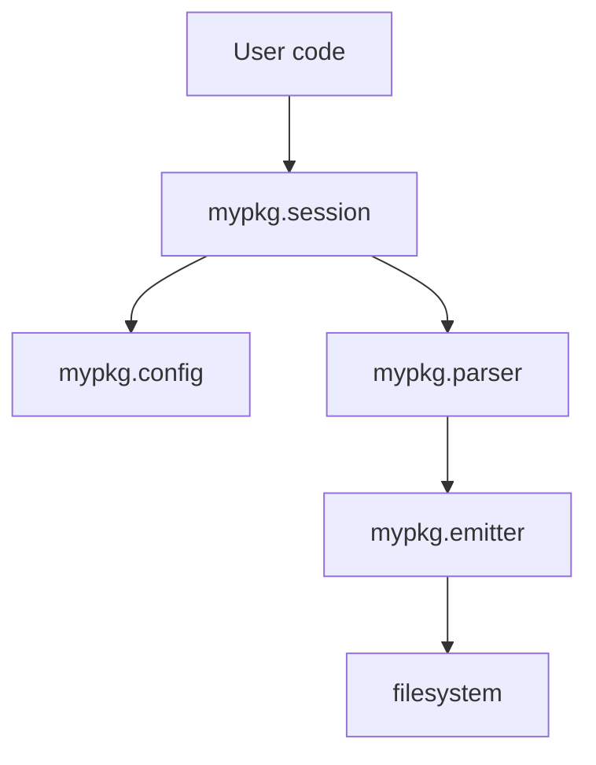

# components.md Formatting Rules (Python library)

"Component" = a Python module or package that owns a clearly-bounded responsibility.

## Structure

```markdown
# Components

## Responsibility table

| Component (module) | Responsibility | Depends on |
|--------------------|---------------|------------|
| `mypkg.session` | Entry point: orchestrates a single library run | `mypkg.config`, `mypkg.parser` |
| `mypkg.parser` | Converts raw input to internal AST | — |
| `mypkg.emitter` | Renders AST to output format | `mypkg.parser` |
| `mypkg.config` | Loads and validates config | stdlib only |
| `mypkg._internal.cache` | Internal memoization helper | stdlib only |

## Interaction graph



## Module state

For each module that holds state (mutable globals, caches, class instances, connection pools), describe what is stored and mutability:

### `mypkg.session`
- `Session.config` — Config snapshot (set once per Session)
- `Session.cache` — result cache (mutable, cleared on `.reset()`)

### `mypkg._internal.cache`
- `_GLOBAL_CACHE` — process-wide LRU (mutable, bounded)
```

## Rules

- **One module per row.** If a package contains multiple modules with separate responsibilities, list each.
- **Responsibility is one sentence.** If unclear → `[GAP]`.
- **Depends on** — internal modules + external dependencies (`stdlib only`, `requests`, `pydantic`, etc.).
- **Module state section** only for modules with state. Stateless pure-function modules skip it.
- **No function signatures.** Those live in `interfaces/*.py`.
- Max 15 nodes in the mermaid graph. Split into subgraphs if needed.
