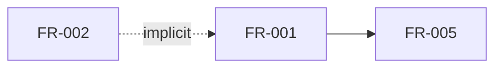

# Generate dependency-graph.md

You are a subagent generating the requirements dependency graph. Fresh context.

## Domain

{{DOMAIN}}

## Read

- Requirements: `{{DATA_FILE}}`
- Glossary: `{{GLOSSARY_OUTPUT}}`
- Formatting rules: `{{PROFILE_DIR}}/formats/dependency-graph.md`

## Write

`{{OUTPUT}}`

## Task

Mermaid graph of relationships between requirements items. Two edge types:

- **explicit dep**: an item references another item by ID ("FR-005 depends on FR-002").
- **implicit dep**: an item assumes another exists ("redeem shares" implies "shares can be minted") but does not state it.

Risks (R items) are threat descriptions only at the requirements level — mitigation is an architecture concern. Do NOT draw "mitigated by" edges from R to FR. R nodes appear in the graph only if they have explicit deps on other items (e.g. R describes a threat that requires a specific FR to exist for the threat to be realizable).

Format:

Below the graph, one section titled `## Review notes` with these sub-bullets (the reviewer scans this section by that exact heading):

- **Disconnected nodes** — items with no incoming or outgoing edges. Most FRs, NFRs, and Cs are legitimately independent. List them here as soft observations. Emit an inline `[GAP]` ONLY when the signal is visible from the tree + Purpose alone (do NOT compare to participant-matrix / boundary-map — those are generated in parallel; reviewer performs cross-artifact checks later):
  - Item duplicates another item (same operation / concern, different wording).
  - Item is not traceable to anything in Purpose (looks orphaned from system intent).
  - An implicit dependency is genuinely required for the item to be verifiable (e.g. FR talks about "previous result" but no FR creates that result).
  All other disconnected items → one bullet with reason like "FR-012 is independent — verify intent". R items are typically disconnected — never flag them.
- **Implicit dependencies not stated** — for each implicit edge, `[GAP]: FR-NN implies FR-MM but does not state it explicitly`. (These are real verifiability gaps.)

## Rules

- Walk every FR/NFR/C/R in `{{DATA_FILE}}`.
- Implicit deps come from action verbs that imply other actions ("withdraw" implies "deposit", "claim" implies "accrue", "unsubscribe" implies "subscribe").
- Use the glossary to identify domain terms whose presence implies other concepts.
- Max 30 nodes per graph. Split into subgraphs if larger.

## Return

`written: {{OUTPUT}}` (inline `[GAP]`/`[CHOICE]` markers go inside the file). Use `fatal: <reason>` only if the subagent cannot run at all.
