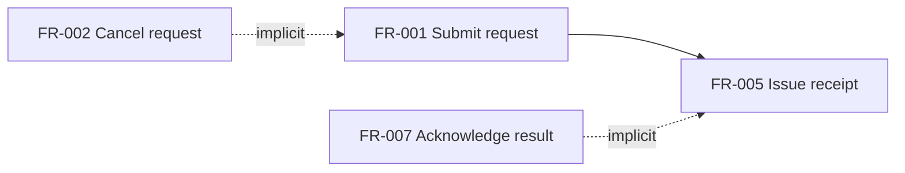

# dependency-graph.md formatting rules

## Structure

```markdown
# Dependency Graph



R items (risks) are threat descriptions only at the requirements level — they do NOT have mitigation edges in this graph. Mitigation is an architecture concern, addressed by ADs in the architecture phase. R items appear here only when they have explicit dependencies on other items (rare).

## Review notes

Exactly this section heading (`## Review notes`) — the reviewer scans for it by name. Two sub-bullets:

- **Disconnected nodes** (informational — NOT automatic gaps):
  - NFR-002: independent quality target — verify intent.
  - C-001: environment constraint — independent by nature.
  - R-* items are typically disconnected at requirements level — do NOT flag them.
  - FR-018: duplicates FR-005 (different wording, same operation).
    [GAP]: FR-018 duplicates FR-005 — keep one, drop the other
  - FR-022: not traceable to any goal in Purpose.
    [GAP]: FR-022 has no link to Purpose — clarify intent or remove
- **Implicit dependencies not stated**:
  - FR-002 implies FR-001 (cancel requires prior submit) — not stated explicitly.
    [GAP]: FR-002 implies FR-001 but does not state it explicitly
```

## Rules

- One graph per artifact. Max 30 nodes; split into subgraphs if larger.
- Edge styles:
  - Solid `-->` for explicit dependency stated in item text.
  - Dashed `-. implicit .->` for implied dependency.
- Below the graph, use the two subsection headers: Disconnected nodes / Implicit dependencies not stated.
- Do NOT draw "mitigated by" edges from R to FR. Architecture (AD) addresses risks, not requirements (FR).
- **Disconnected nodes are NOT automatic gaps.** Most independent FRs/NFRs/Cs are legitimate. Mark as review note only — emit `[GAP]` only when a signal is visible from the tree + Purpose alone:
  - duplicates another item,
  - not traceable to Purpose,
  - implicit dep is required for verifiability (e.g. references "previous result" with no FR producing it).
- **Do NOT compare disconnected items to participant-matrix or boundary-map here** — those run in parallel and may not be available. Cross-artifact contradictions are surfaced by the reviewer.
